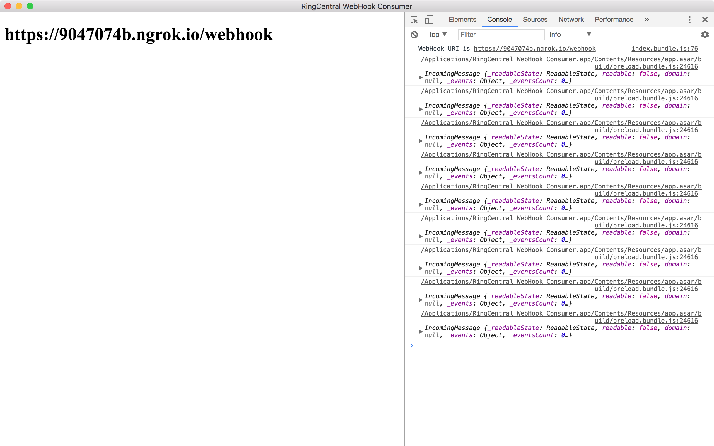

# ringcentral-webhook-consumer

Out-of-box consumer for RingCentral WebHook, mainly for testing and troubleshooting purpose.

Once you start the app, it will show you an WebHook url, which you can use to setup the subscription.

Then you just watch the devtools console to monitor the incoming notifications!


# [Download pre-built installers](https://github.com/tylerlong/ringcentral-webhook-consumer/releases)




## Setup

```
yarn install
```


## Development

```
yarn build:watch
yarn start
```


## Pack

```
yarn dist:dev
```


## Distribution

```
yarn dist
```
